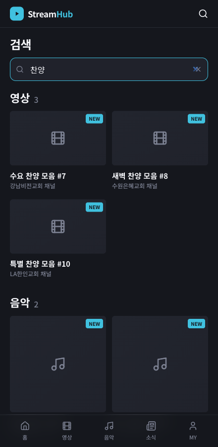
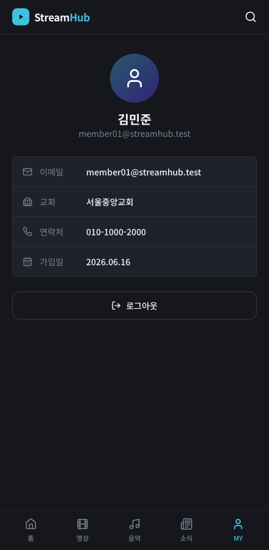
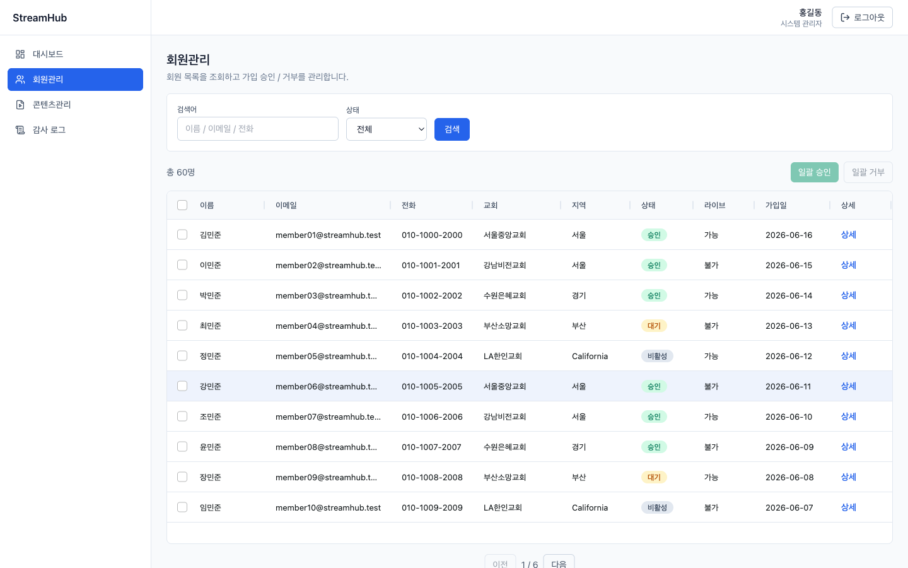
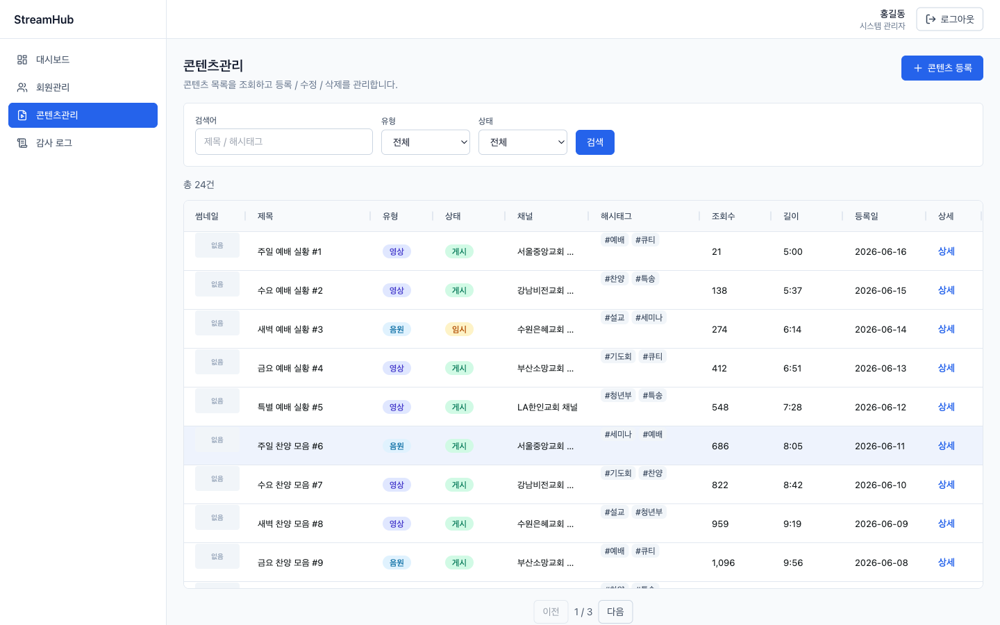

# StreamHub

[한국어](README.md) · **English**

A full-stack portfolio project that reproduces a church/streaming platform **using the same production
stack as the real service**. A single Spring Boot backend powers two frontends — an **operator admin
console** and a **public user media site** — covering authentication, RBAC, file upload, cached
statistics, asynchronous audit logging, and member login as working vertical slices. It runs locally
with `docker-compose` and deploys to AWS via Terraform.

> **Demo accounts**
> - Admin console — `admin` / `admin1234` (system), `manager` / `manager1234` (church manager)
> - User site — `member01@streamhub.test` / `member1234`

---

## Screenshots

### User site (mobile · dark)
<p>
  
  
  
  
</p>

### Admin console (desktop)


| Members (AG Grid) | Content management |
|---|---|
|  |  |

---

## Architecture

```
┌─────────────────────────────┐   ┌─────────────────────────────┐
│ streamhub-web (admin console)│   │ streamhub-user-web (user)    │
│ Next14·NextAuth v5·ReactQuery│   │ Next14·React Query·mobile UI │
│ AG Grid·ApexCharts·RHF+Zod   │   │ public (read-only)+ login    │
└──────────────┬──────────────┘   └──────────────┬──────────────┘
   /v1/** (Bearer JWT, admin)         /pub/v1/** (public) · /pub/v1/auth (member)
               └───────────────┬───────────────────┘
                               ▼
        ┌──────────────────────────────────────────────┐
        │       streamhub-api (Spring Boot 3.4)          │
        │  SecurityFilterChain (stateless JWT)           │
        │   └ admin token ↔ member token isolation       │
        │  Controller → Service                          │
        │   ├ Repository (JPA, simple CRUD)              │
        │   └ Mapper (MyBatis, dynamic search/joins/agg) │
        └────┬──────────┬───────────┬──────────┬─────────┘
          MySQL 8     Redis      S3 / MinIO   SQS / LocalStack
```

**Key design decisions**
- **JPA + MyBatis hybrid** — JPA for simple CRUD, MyBatis XML for dynamic search/joins/aggregation.
- **Stateless JWT + token isolation** — admin tokens carry a role claim; member tokens (`type:member`,
  no role) are structurally blocked from admin endpoints in the auth filter.
- **Proactive token rotation** — NextAuth refreshes before expiry; refresh tokens are whitelisted in
  Redis so logout invalidates them.
- **No-swap S3 SDK** — local MinIO ↔ prod S3 switched only by `storage.endpoint`, zero code change.
- **Async audit log** — key actions published to SQS, consumed by `@SqsListener` (best-effort).
- **RBAC** — `@PreAuthorize` + JWT-claim `AdminPrincipal` scopes church managers to their own church.
- **API contract automation** — backend Swagger → Orval → type-safe React Query hooks (admin).

---

## What's inside

### Admin console (`streamhub-web`)
| Domain | Techniques shown |
|---|---|
| **Members** | dynamic search/filter/pagination (MyBatis) · detail/edit · bulk approve/deny · church-scoped RBAC |
| **Content** | CRUD · many-to-many hashtags · **drag-and-drop upload → MinIO/S3** · complex joins |
| **Dashboard** | MyBatis aggregation · **Redis caching (@Cacheable)** · ApexCharts (trend/Top N/donut) |
| **Audit log** | admin actions published/consumed via SQS, visible to system admins only |

### User site (`streamhub-user-web`)
A mobile-first public media site in the tone of a real production user app.
- **Video / music** (HTML5 players) and **posts** — only `PUBLISHED` content is exposed
- **URL-based unified search** (`?q=`, shareable/refresh-safe, title match) · pagination
- **Member login + my page** — member-scoped JWT, localStorage session, protected routes

---

## Tech stack

**Backend** — Spring Boot 3.4 · Java 21 · MySQL 8 · Redis · JPA(Hibernate) + MyBatis · Spring Security +
JWT(auth0) · AWS SDK v2 (S3/SQS) · spring-cloud-aws · springdoc OpenAPI · Lombok · JUnit 5 + Mockito

**Frontend** — Next.js 14 (App Router) · React 18 · TypeScript · TanStack React Query v5 · NextAuth v5
(admin) · Zustand · Orval · AG Grid Community · ApexCharts · React Hook Form + Zod · Tailwind CSS ·
Vitest

**Infra** — Docker Compose (local) · Terraform (AWS: EC2/RDS/S3/SQS/ECR/SSM) · Vercel · GitHub Actions

---

## Run locally

Prerequisites: Docker (or Colima), JDK 21, Node 20.

```bash
# 1) Infra (MySQL + Redis + MinIO + LocalStack)
docker compose up -d

# 2) Backend (localhost:8080) — creates schema + seeds demo data on first boot
cd streamhub-api && ./mvnw spring-boot:run

# 3) Admin console (localhost:3000)
cd streamhub-web && npm install --legacy-peer-deps && npm run dev

# 4) User site (localhost:3001)
cd streamhub-user-web && npm install --legacy-peer-deps && npm run dev
```

- Swagger UI: http://localhost:8080/swagger-ui/index.html
- MinIO console: http://localhost:9001 (streamhub / streamhub123)
- Regenerate admin API client (backend running): `cd streamhub-web && npm run gen`

> Node 20 LTS recommended. Seed: 5 churches · 60 members · 24 contents · 10 posts · 800 watch events.

---

## Tests

```bash
cd streamhub-api && ./mvnw test          # 24 JUnit/Mockito tests
cd streamhub-user-web && npm test        # 15 Vitest tests
```
Backend: JWT issue/verify/rotation + **admin↔member token isolation**, member RBAC scoping & state
transitions, member login (status gate / failure paths), public-post `PUBLISHED` enforcement, and a
standalone MockMvc slice for the public controller. Frontend: formatting helpers and the typed fetch
wrapper (success unwrap, `ApiError` status mapping, bearer header).

---

## Deploy (AWS)

See `deploy/README.md` — Terraform provisions EC2/RDS/S3/SQS/ECR, `deploy/scripts/deploy-api.sh`
pushes the image to ECR and rolls it out via SSM, frontend goes to Vercel. `terraform destroy` tears
everything down in one shot (cost safety).

---

## Project structure

```
streamhub-admin/
├── streamhub-api/        # Spring Boot (base/ · auth/ · v1/{admin,member,content,statistics,actionlog,post,pub})
├── streamhub-web/        # Admin Next.js (src/app · src/apis/query[Orval] · src/components)
├── streamhub-user-web/   # User Next.js (src/app · src/components · src/lib[manual fetch+RQ])
├── deploy/               # Terraform IaC · deploy scripts · runbook
├── docker-compose.yml    # MySQL · Redis · MinIO · LocalStack
└── PLAN.md / USER-SITE-PLAN.md  # design docs + roadmap
```
