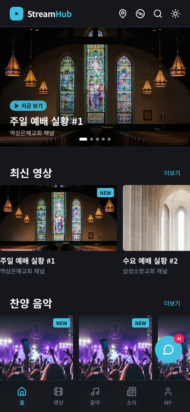
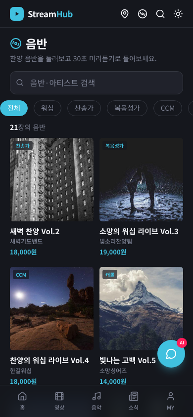
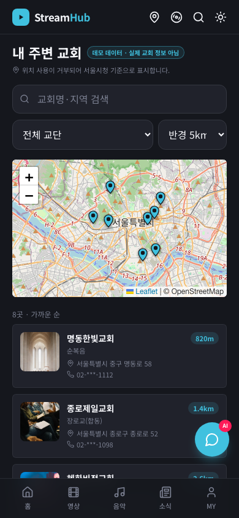
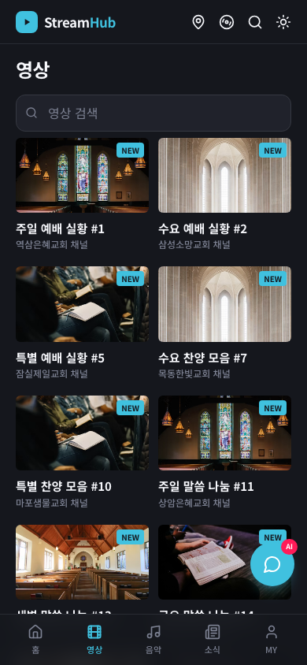
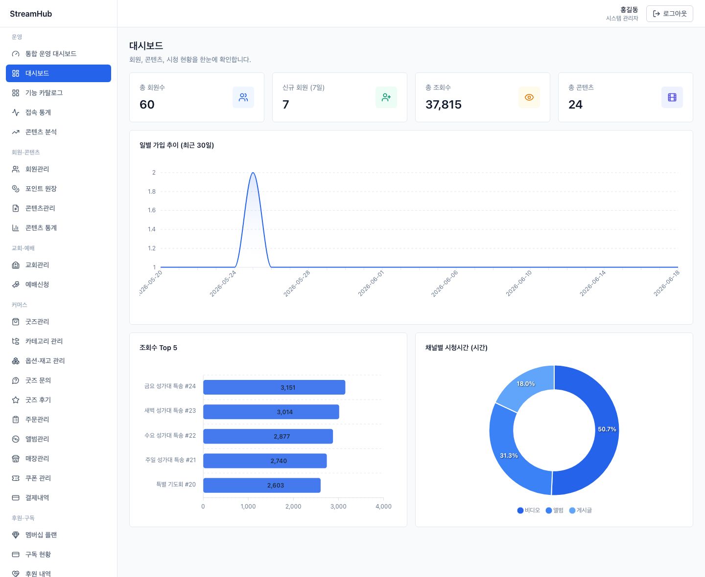
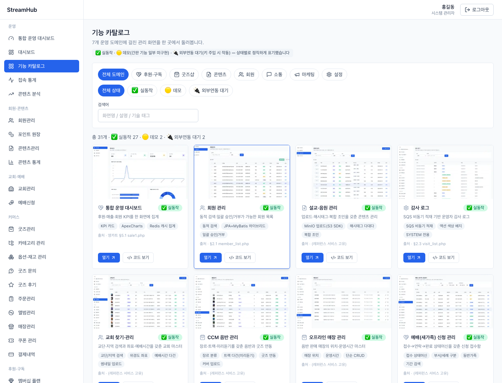
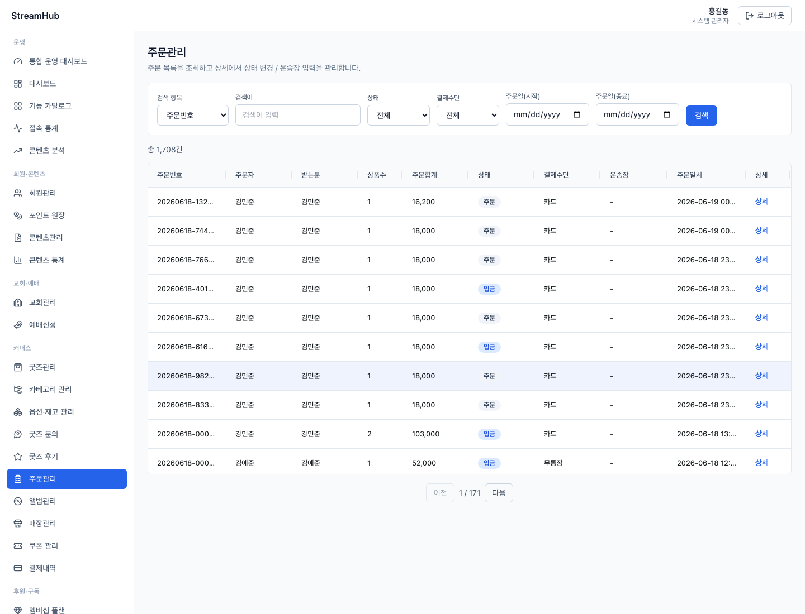

# StreamHub

**한국어** · [English](README.en.md)

교회/스트리밍 플랫폼을 실제 운영 서비스의 프로덕션 스택 그대로 재현한 풀스택 포트폴리오입니다.
하나의 Spring Boot 백엔드 위에 관리자 콘솔과 공개 사용자 사이트, 그리고 AWS 배포 파이프라인까지 올라갑니다.

> **기능·화면·통계 전체 쇼케이스는 로드맵 페이지에 있습니다 → https://streamhub-user.vercel.app/roadmap**
> 이 README는 중복을 피해 **아키텍처·실행 방법 등 개발자용 정보**만 담습니다.

> **🔗 라이브**
> - 로드맵(쇼케이스) — https://streamhub-user.vercel.app/roadmap
> - 사용자 사이트 — https://streamhub-user.vercel.app
> - 관리자 콘솔 — https://streamhub-admin.vercel.app
>     - `admin` / `admin1234` (시스템 — 전체 데이터)
>     - `manager` / `manager1234` (교회 관리자 — 본인 교회 데이터로 스코핑, RBAC 멀티테넌시 확인용)
> - API(Swagger) — https://dpdtwguq8ke3x.cloudfront.net/swagger-ui/index.html
> - 사용자 데모 계정 — `member01@streamhub.test` / `member1234`

---

## 스크린샷

### 사용자 사이트 (모바일 · 다크)
<p>
  
  
  
  
</p>

### 관리자 콘솔 (데스크탑)


| 기능 카탈로그 (실동작/데모/외부연동 정직 배지) | 주문관리 (AG Grid · 상태머신) |
|---|---|
|  |  |

---

## 아키텍처

```
┌─────────────────────────────┐   ┌─────────────────────────────┐
│ streamhub-web  (관리자 콘솔)  │   │ streamhub-user-web (사용자)   │
│ Next14·NextAuth v5·React Query│   │ Next14·React Query·모바일 UI  │
│ AG Grid·ApexCharts·RHF+Zod   │   │ 공개(읽기전용)+회원 로그인     │
└──────────────┬──────────────┘   └──────────────┬──────────────┘
   /v1/** (Bearer JWT, 관리자)        /pub/v1/** (공개) · /pub/v1/auth (회원)
               └───────────────┬───────────────────┘
                               ▼
        ┌──────────────────────────────────────────────┐
        │       streamhub-api (Spring Boot 3.4)          │
        │  SecurityFilterChain (stateless JWT)           │
        │   └ 관리자 토큰 ↔ 회원 토큰 격리 (role 클레임)   │
        │  Controller → Service                          │
        │   ├ Repository (JPA, 단순 CRUD)                │
        │   └ Mapper (MyBatis, 동적 검색·조인·집계)       │
        └────┬──────────┬───────────┬──────────┬─────────┘
          MySQL 8     Redis      S3 / MinIO   SQS / LocalStack
          (주 DB)    (캐시)    (미디어 저장)  (감사로그 큐)
```

**핵심 설계 결정**
- **JPA + MyBatis 하이브리드** — 단순 CRUD는 JPA, 동적 검색·조인·집계는 MyBatis XML.
- **Stateless JWT + 토큰 격리** — 관리자 토큰(role 클레임)과 회원 토큰(`type:member`, role 없음)을 분리해, 회원 토큰으로는 관리자 API에 절대 닿지 못하게 필터에서 차단.
- **토큰 자동 회전** — NextAuth jwt 콜백에서 만료 전 선제 갱신, refresh 토큰은 Redis 화이트리스트로 로그아웃 시 무효화.
- **S3 SDK 무전환** — 로컬 MinIO ↔ 운영 S3를 `storage.endpoint` 유무로만 분기, **코드 변경 0**.
- **비동기 감사로그** — 주요 액션을 SQS로 발행 → `@SqsListener`가 소비해 영속화(best-effort, 실패해도 본 트랜잭션 무영향).
- **RBAC + 멀티테넌시** — `@PreAuthorize` + JWT 클레임 기반 `AdminPrincipal`로 교회 관리자를 본인 교회 데이터로 스코핑(DB 조회 없음).
- **API 계약 자동화** — 백엔드 Swagger → Orval → 타입 안전 React Query 훅(관리자측).

---

## 외부 연동 지점 (adapter seam)

외부 서비스는 코드 분기가 아니라 **빈 교체 + `.env` 플래그**로 전환됩니다(서비스는 인터페이스에만 의존).
기본은 키 없는 결정론적 목업/시드이고, 키를 주입하면 실연동으로 갈아끼워집니다.

| seam (인터페이스) | 플래그 | 기본 → 실연동 |
|---|---|---|
| `PaymentProvider` | `app.payment.provider`, `app.payment.toss.*` | `mock` → `toss`(상시등록, 키만) / `kakao`·`paypal`(키 게이트) |
| `DeliveryProvider` | `app.delivery.provider` | `sweettracker`(기본·데모키) ↔ `mock` |
| `SmsSender` | `app.sms.sender` | `mock` → `aligo`/`solapi` (API 키·발신번호) |
| `ChatProvider` | `app.chat.provider`, `app.chat.llm.api-key` | `rule` → `llm` |
| `MusicPreviewProvider` | `app.music.provider` | `seed` → `external` (음원 API) |
| `GeocodeProvider` | `church.geocode.provider`, `church.geocode.kakao-rest-key` | `seed` → `kakao` (Kakao Local) |

> 예: 토스 결제는 `PAYMENT_TOSS_CLIENT_KEY` / `PAYMENT_TOSS_SECRET_KEY` 두 env만 주입하면 코드 변경 없이 실 샌드박스 PG가 동작합니다(승인·환불 포함).

---

## 로컬 실행

사전 준비: Docker(또는 Colima), JDK 21, Node 20.

```bash
# 1) 인프라 (MySQL + Redis + MinIO + LocalStack)
docker compose up -d

# 2) 백엔드 (localhost:8080) — 첫 기동 시 스키마 생성 + 데모 데이터 시드
cd streamhub-api && ./mvnw spring-boot:run

# 3) 관리자 콘솔 (localhost:3000)
cd streamhub-web && npm install --legacy-peer-deps && npm run dev

# 4) 사용자 사이트 (localhost:3001)
cd streamhub-user-web && npm install --legacy-peer-deps && npm run dev
```

- Swagger UI: http://localhost:8080/swagger-ui/index.html
- MinIO 콘솔: http://localhost:9001 (streamhub / streamhub123)
- 관리자 API 클라이언트 재생성(백엔드 기동 상태에서): `cd streamhub-web && npm run gen`

---

## 테스트

```bash
cd streamhub-api && ./mvnw test
```
JUnit 5 + Mockito 단위 테스트 — JWT 발급/검증/회전 + 관리자↔회원 토큰 격리, 회원 RBAC 스코핑·상태 전이,
쿠폰 할인 계산, 주문/구독 상태머신, 정기결제 멱등성·실패 처리 등.

---

## 배포

- **백엔드** — Terraform으로 AWS(EC2 + RDS + S3 + SQS + ECR + SSM) 프로비저닝, EC2 컨테이너를 CloudFront(HTTPS) 뒤에 둠. `main`에 `streamhub-api/**` 변경 푸시 시 GitHub Actions가 빌드→ECR→SSM 무중단 롤. 수동: `gh workflow run deploy.yml`.
- **프론트** — Vercel(관리자·사용자) GitHub 연동, `main` 푸시 시 자동 재배포.
- 상세 절차 `deploy/README.md` · 무료/저비용 단일 VM 대안 `DEPLOY-FREE.md` · 인프라 정리 `terraform destroy`.

---

## 프로젝트 구조

```
streamhub-admin/
├── streamhub-api/        # Spring Boot (org.streamhub.api: base/ · auth/ · v1/{admin,member,content,statistics,actionlog,post,pub,goods,order,donation,dashboard,coupon,...})
├── streamhub-web/        # 관리자 Next.js (src/app/(protected)/** · src/apis/query[Orval 자동생성])
├── streamhub-user-web/   # 사용자 Next.js (src/app · src/components · src/lib[수동 fetch + React Query])
├── deploy/               # Terraform IaC · 배포 스크립트 · 런북
├── docker-compose.yml    # MySQL · Redis · MinIO · LocalStack
└── docs/                 # 도메인 설계 스펙(specs/) · 설계문서 · 스크린샷
```
